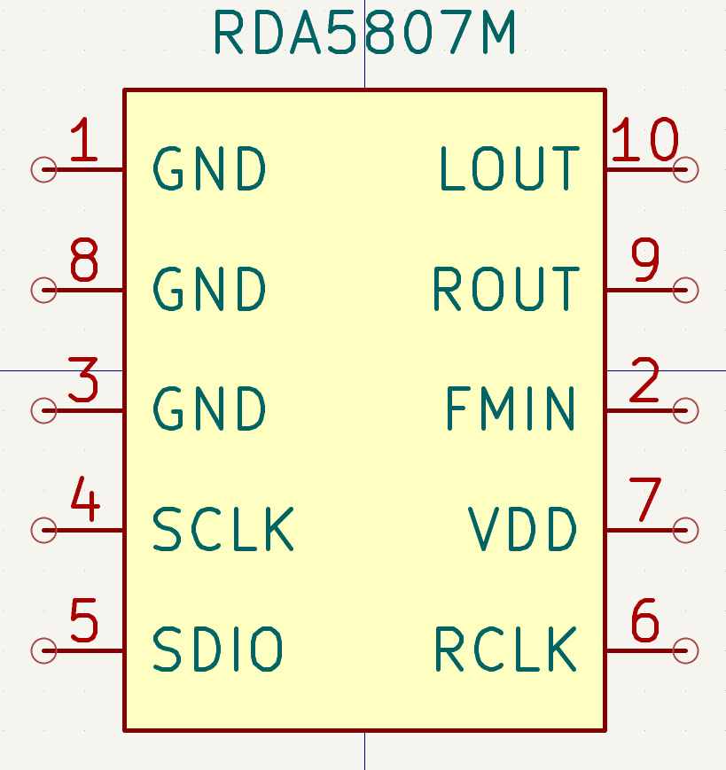
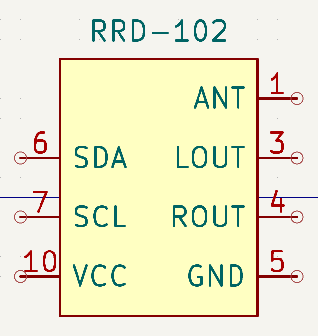
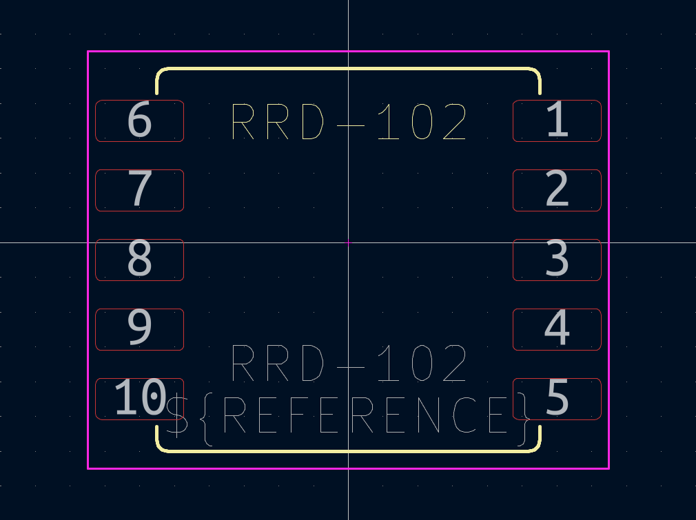

# Hardware symbols and footprints

> [!IMPORTANT]
> These files were **not** tested on a real PCB yet. Use at your own risk.

`RRD-102` is a small SMD board with RDA5807M IC, 32.768kHz crystal oscillator and few other components pre-soldered. It uses 2.0mm pin pitch for easier soldering. The `FMIN` pin is renamed to `ANT`.  

## Symbols
**All** symbols are in the `RDA5807.kicad_sym` file.  

### RDA5807M

### RRD-102

## Footprints

### RDA5807M
Uses regular `10-Pin MSOP` SMD package.

### RRD-102
`RRD-102.kicad_mod`  

